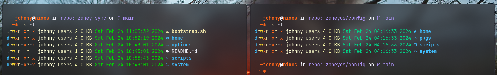
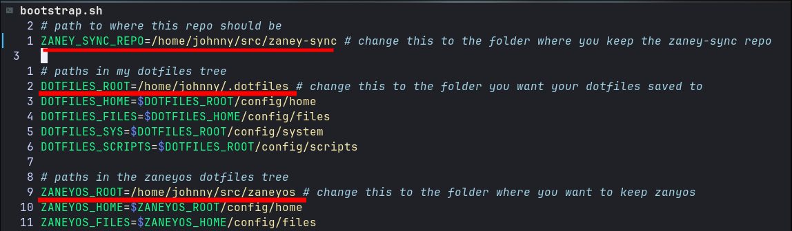
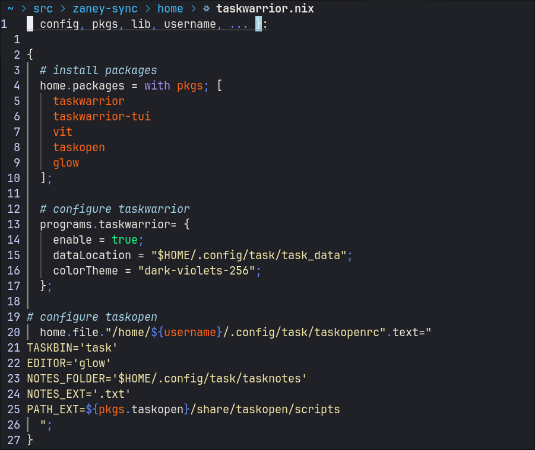
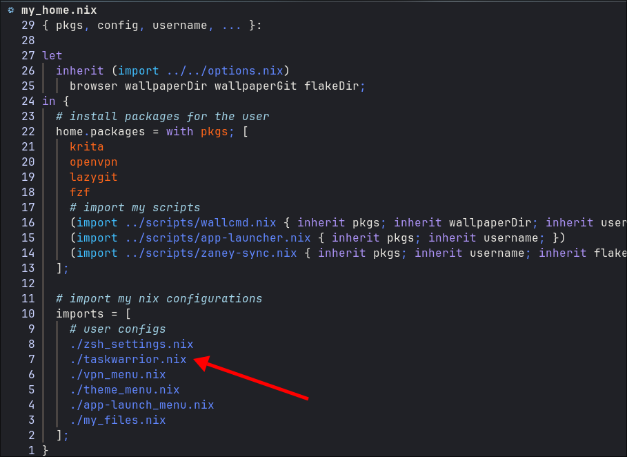

# zany-sync
This is how I keep my nix configurations syncronized with [zaneyos](https://gitlab.com/Zaney/zaneyos). The folder structure is similar to what's in zaneyos

when you clone this repo int ~/src and run `bootstrap.sh` it will copy all of the files from this repo's home,system and scripts folders 
into wherever your dotfiles are being kept. Then it runs some sed commands to make sure `home/my_files.nix`,`home/my_home.nix` and `system/my_system.nix`
are all appended in their respective `default.nix` files from zaneyos.

Then run a `flake-rebuild` to update the flake and after doing this, you should be able to run `zany-sync` from the command line which will do all of this 
for you again.
        - right now you need to write these into zaney-sync but in the future it will be inherited from options.nix

# How To Customize
## Run clean-tree.sh
run the `clean-tree.sh` script from the root of this repository to delete my configs and replace them with empty templates to get you started 
managing your own.

This script deletes out all of my stuff and copies in the bare minimum you'd need to have `zany-sync` working. It will prompt you for the path you'd like 
to keep your configuration files in. Then it will run some sed commands to place those paths in the script.

## Run bootstrap.sh
If you ran `clean-tree.sh` then, you don't need to edit this and it was done for you by running the script. If you wanted to use my configs or you are me 
and ran this for whatever reason then you can just edit these variables by hand in the `bootstrap.sh` file

## Make it your own 
As often as you can; make all of your configurations in their own nix files, they might look something like this.

if it was an added nix file from the home directory, then make sure to add it to `my_home.nix`

**home/my_home.nix** is where you'd add new nix files to include or files that need to be copied into your home dir (kinda like home/packages.nix)

**home/files.nix** is where you'd add new files that need to be created and copied over to the home folder 
(kinda like zaney's home/files.nix - likewise, files are kept in the home/files folder)

**system/my_system.nix** is where you'd add system nix files and packages to be included
